# LightRAG Transcript

A pipeline that converts long, multi-speaker recordings into speaker-attributed
transcripts and a queryable knowledge graph, such that a question of the form
*"What did Ana say about the budget, and when?"* yields an answer traceable to
the precise moment in the source audio.

## Motivation

A raw transcript of a two-hour parliamentary session or panel discussion is of
limited utility: all voices collapse into a single undifferentiated body of
text, and the relevant content is dispersed across segments separated by hours.
This work addresses the problem in three stages — establishing **who spoke
when**, assigning those voices **stable identities across recordings**, and
indexing the result as a **graph of entities and relations** rather than as flat
text, so that retrieval may follow speakers and topics rather than match surface
forms.

The system targets **Macedonian**, a low-resource and dialect-rich language for
which off-the-shelf speech tooling performs least reliably: labelled data is
scarce, pronunciation varies substantially by region, and the available corpora
seldom reflect authentic spoken usage.

This repository implements the speech-understanding stages — diarization,
speaker labelling, and retrieval. Adaptation of the ASR model is carried out
separately; the resulting checkpoint is supplied through `WHISPER_MODEL`.

## Language

The pipeline is configured for Macedonian in `.env`:

```
LANGUAGE_CODE=mk          # the language Whisper transcribes in
LANGUAGE_NAME=Macedonian  # the language the knowledge base is told it reads
```

The Macedonian prompts are confined to two directories:

- `domain/prompts/` — chunk enrichment, summary, keyword extraction, and speaker
  identification
- `infrastructure/rag/prompts/` — entity extraction and answer generation

Nothing in the architecture itself is specific to Macedonian: diarization,
clustering, speaker matching, chunking, and retrieval are language-independent,
and speaker embeddings encode vocal rather than lexical characteristics.

## Ingestion



*Figure 1: The ingestion pipeline, from audio upload to indexed knowledge
graph.*

<sup>Source: [`docs/diagrams/ingestion.mmd`](docs/diagrams/ingestion.mmd), rendered as a
static image because GitHub's live Mermaid renderer clips node text.
Regenerate with `mmdc -i docs/diagrams/ingestion.mmd -o docs/diagrams/ingestion.svg -b white`.</sup>

Diarization is the computationally dominant stage; its output is therefore
cached in MinIO, and the `resume` operation re-executes all subsequent stages
without repeating it.

### Speaker resolution

Speakers are recognised by voice across recordings rather than within a single
recording alone. The centroid embedding of each cluster is compared against a
Postgres/pgvector directory of known speakers; only those clusters that this
comparison fails to resolve are passed to an LLM, and only the names the LLM
supplies are written back to the directory.



*Figure 2: Precedence in speaker resolution.*

<sup>Source: [`docs/diagrams/speaker-resolution.mmd`](docs/diagrams/speaker-resolution.mmd).
Regenerate with `mmdc -i docs/diagrams/speaker-resolution.mmd -o docs/diagrams/speaker-resolution.svg -b white`.</sup>

Empirical evidence takes precedence over inference: a directory match always
supersedes an LLM proposal. Optional hints (`known_speakers`) are supplied to
the LLM as candidate names.

## Retrieval

Each question is first mined for speaker names and dates, which are passed to
LightRAG as retrieval keywords: specific mentions drive fine-grained retrieval,
whereas topic-level structure drives the aggregated mode. Every indexed chunk
carries `[SOURCE]`, `[SPEAKER]`, and `[TIMESTAMP]` tags, so that an answer may
be traced back to a moment in a recording and returned as a playable link.

Two chunking strategies are selectable via `CHUNKER_TYPE`:

- `block` — aggregates consecutive speaker turns into a single retrieval unit,
  preserving conversational flow (a sliding-window chunker)
- `contextual` — one unit per speaker turn, each rewritten by an LLM using
  context drawn from adjacent turns, preserving fine-grained speaker attribution

## Installation

The system runs against a local PostgreSQL 16 instance and a local MinIO server;
no containerization is required.

```bash
brew install postgresql@16 pgvector age minio
```

`pgvector` and `age` (Apache AGE) are distributed as separate formulae: they
install as Postgres extensions but are not bundled with `postgresql@16` itself.

```bash
# one-time: create the database
createdb lightrag

cp .env.example .env          # supply the secrets; POSTGRES_* / MINIO_* default to localhost
pip install -r requirements.txt
```

The application provisions its own tables, extensions, and MinIO bucket on first
startup; no further manual configuration is required.

## Running the system

Both Postgres and MinIO must be running before the API is started, as the API
connects to them and initializes the knowledge base eagerly and will therefore
fail immediately if either is unavailable.

```bash
pg_ctl -D /opt/homebrew/var/postgresql@16 start
minio server /opt/homebrew/var/minio --address :9000 --console-address :9001 &

uvicorn presentation.api.app:app --reload    # API on :8000
cd frontend && npm install && npm run dev    # UI on :5173
```

Postgres may alternatively be configured to start on login with `brew services
start postgresql@16`. MinIO is not distributed as a brew service and must
therefore be started manually, or through a user-supplied launchd/systemd unit,
in each session.

Postgres is stopped with `pg_ctl -D /opt/homebrew/var/postgresql@16 stop`; MinIO
is stopped with `kill %1`, or by its process id, when started in the foreground
or backgrounded as above.

## Usage

### Ingesting a recording

With the API and interface running, a recording is uploaded at
`http://localhost:5173`, optionally accompanied by the date, time, show name,
location, and known speakers (a comma-separated list of candidate names supplied
to the LLM). Progress is streamed as the pipeline proceeds through segmentation,
diarization, transcription, speaker resolution, summarization, and indexing.

The corresponding endpoint may also be invoked directly:

```bash
curl -N -X POST http://localhost:8000/api/pipeline/run \
  -F "audio_file=@session.mp3" \
  -F "date=2026-03-05" \
  -F "show_name=Plenary Session" \
  -F "known_speakers=Ana Petrova,Marko Ilievski"
```

The response is a stream of Server-Sent Events terminating in the transcript,
its metadata, and a speaker-resolution report.

Because diarization output is cached in MinIO, an ingestion that fails partway
through may be resumed rather than repeated in full:

```bash
curl -N -X POST http://localhost:8000/api/pipeline/resume \
  -H "Content-Type: application/json" \
  -d '{"stem": "session"}'
```

### Querying

Questions may be submitted through the interface or directly to the API:

```bash
curl -X POST http://localhost:8000/api/query \
  -H "Content-Type: application/json" \
  -d '{"question": "What did Ana say about the budget, and when?"}'
```

The response comprises the generated answer together with the source segments on
which it is grounded, each identified by stem and timestamp and resolvable to a
playable audio link.

### Inspecting the corpus

The ingested recordings may be enumerated, and the audio for any one of them
retrieved, as follows:

```bash
curl http://localhost:8000/api/transcripts
curl http://localhost:8000/api/transcripts/session/audio
```

### Rebuilding the knowledge graph

The transcripts already persisted in MinIO may be re-indexed without repeating
diarization or transcription. This is appropriate after modifying the chunking
strategy, the prompts, or the embedding model:

```bash
python main.py --build
```

### Tests

```bash
pytest
```

## Evaluation

The dataset
[`stojchevamarija/mk-parliament-qa`](https://huggingface.co/datasets/stojchevamarija/mk-parliament-qa),
published on Hugging Face, provides a question–answer set derived from two
Macedonian parliamentary session recordings. Provided that those two recordings
are first ingested through this pipeline, the dataset may be used to evaluate
the system end to end: each question is submitted to `/query`, or through the
interface, and the generated answer is compared against the corresponding
reference answer, yielding a joint measure of retrieval and answer quality.

## Repository structure

```
domain/          transcripts, speakers, metadata, chunking — plain Python, no I/O
application/     the use cases: ingest, query, build graph
infrastructure/  MinIO, Postgres, NeMo, Whisper, OpenAI, LightRAG
presentation/    FastAPI routes and the CLI
composition.py   wires it all together — the only place adapters are created
```

Dependencies point inward: presentation → application → domain, with
infrastructure implementing the interfaces declared in `domain/ports.py`.
Substituting a database, model, or storage backend therefore requires only a new
adapter and a corresponding change to `composition.py`.
